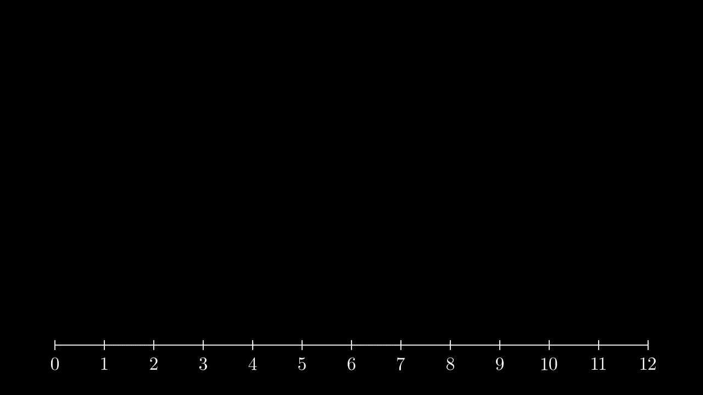

# Playing animations in a timeline

This plugin provides the function `play_timeline()` which allows for launching several animations, at different instants, each one with a different duration, so that there can be several ones playing in parallel and finishing at different moments.

The interface is simple. You provide a dictionary whose keys are the timestamps at which each animations should start, and the values are the animations to play at those timestamps. It is possible to pass a list of animations for any given timestant, and in that case all those animations will start at once. The timestamps are relative to the time in which the whole timeline starts.

You can find a `demo.py` in this folder, which runs a timeline in which:

* A progress bar increases linearly from timestamp 0 up to timestamp 12 (used as a reference)
* At timestamp 1, a Square is created during 10 secs
* At timestamp 2, a Circle and a Triangle are created, during 4 secs and 2 secs respectively
* At timestamp 9, a Text is written during 3 secs

This is the code:

```python
class Test(Scene):
    """Example showing how to use play_timeline."""
    def construct(self):
        n = NumberLine(include_numbers=True, x_range=[0,12]).to_edge(DOWN)
        self.add(n)
        progress_bar = Line(n.n2p(0), n.n2p(12)).set_stroke(color=YELLOW, opacity=0.5, width=20)

        # Create a timeline of animations. One of the animations is the progress bar itself
        # going from 0 to 12 in 12 seconds. It can be used as a reference to check that
        # the other animations are playing at the right time.
        timeline = {
            0: Create(progress_bar, run_time=12, rate_func=linear),
            1: Create(Square(), run_time=10),
            2: [Create(Circle(), run_time=4),
                Create(Triangle(), run_time=2)],
            9: Write(Text("It works!").next_to(progress_bar, UP, buff=1), 
                     run_time=3)
        }
        play_timeline(self, timeline)
        self.wait()       
```

And this is the result:

